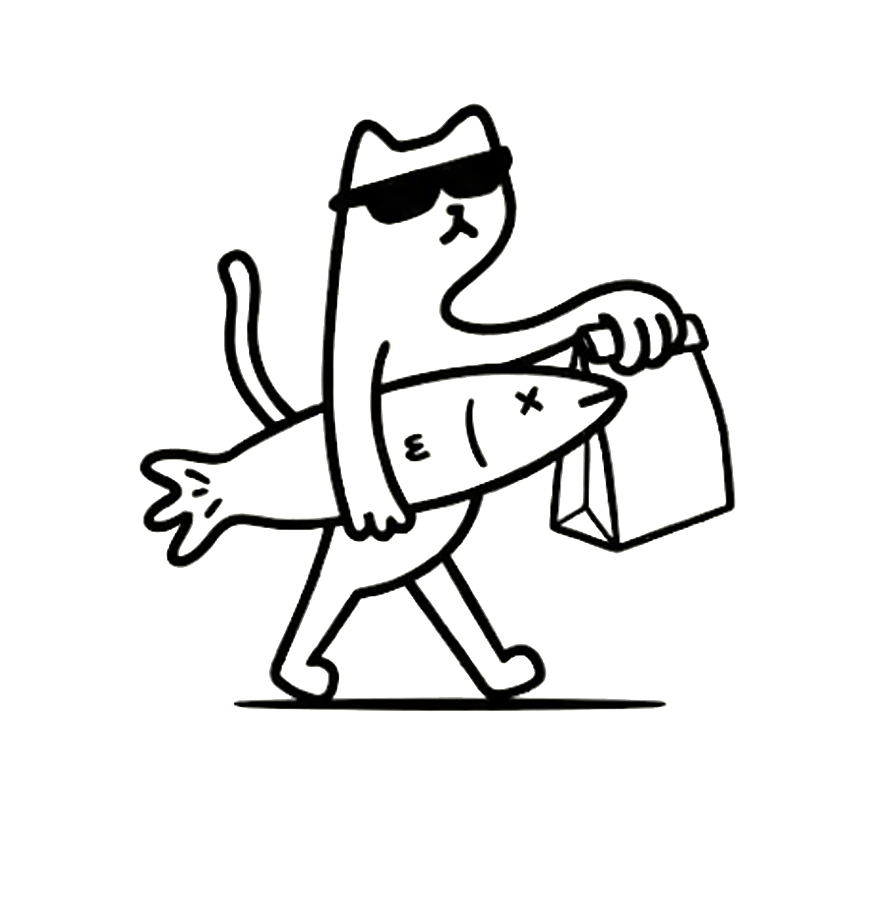

<div align="center">



# 🐱 CATCATCH
### *Atrápalo antes que se acabe.*

[](https://developer.mozilla.org/es/docs/Web/HTML)
[](https://developer.mozilla.org/es/docs/Web/CSS)
[](https://developer.mozilla.org/es/docs/Web/JavaScript)
[](https://greensock.com/gsap/)

> **Conectamos personas con comida de calidad a precios que no se repiten.**  
> Descubre combos sorpresa de restaurantes cercanos, ahorra en cada compra y atrapa oportunidades antes de que se acaben.

🌍 **Medellín, Colombia** &nbsp;|&nbsp; 📧 catcatch@hotmail.com &nbsp;|&nbsp; 📞 +57 324 3493284

</div>

---

## 🚀 ¿Qué es CatCatch?

**CatCatch** es una plataforma web que une a usuarios con restaurantes, panaderías y cafeterías locales para ofrecer **combos sorpresa a precios increíbles** — reduciendo el desperdicio de alimentos y ayudando al planeta de paso.

Cada combo es una oportunidad limitada. Una vez que se acaban... ¡se acaban! Por eso el lema:  
> *"Atrápalo antes que se acabe."* 🐾

---

## ✨ Características Destacadas

| Característica | Descripción |
|---|---|
| 🎯 **Combos Sorpresa** | Paquetes de comida de calidad con hasta **-50% de descuento** |
| ⚡ **Tiempo Real** | Visualiza combos disponibles cerca de ti al instante |
| ♻️ **Impacto Verde** | Reduce el desperdicio alimentario en restaurantes locales |
| 🏪 **Red de Aliados** | Más de **120 restaurantes** participantes |
| 💚 **Combos Salvados** | Más de **3.000 combos** rescatados del desperdicio |

---

## 📊 Impacto en Números

<div align="center">

| 🏷️ Descuento Máximo | 🤝 Restaurantes Aliados | 🍱 Combos Salvados |
|:---:|:---:|:---:|
| **50%** | **120+** | **3.000+** |

</div>

---

## 🔄 ¿Cómo Funciona?

```
  01. RESTAURANTE PUBLICA
      └── El negocio carga sus combos sorpresa del día
          con hasta 50% de descuento antes de cerrar.

  02. TÚ LO DESCUBRES
      └── Ves los combos disponibles cerca de ti
          en tiempo real. Precio fijo, sorpresa garantizada.

  03. ATRÁPALO 🐾
      └── Reservas → Vas → Recoges.
          Comida buena a precio justo — y el planeta agradece.
```

---

## 🛠️ Tecnologías Utilizadas

- **HTML5** — Estructura semántica y accesible
- **CSS3** — Diseño editorial moderno, animaciones fluidas y diseño totalmente responsivo
- **JavaScript (Vanilla)** — Interactividad avanzada sin frameworks
- **GSAP + ScrollTrigger** — Animaciones premium de entrada, salida y parallax
- **Google Fonts** — Tipografías *Titan One*, *Playfair Display* e *Inter*

---

## ✨ Efectos & Animaciones

- 🖱️ **Cursor personalizado** con efecto magnético en botones y enlaces
- 📜 **Barra de progreso de scroll** en tiempo real
- 🎭 **Animaciones de entrada** con Intersection Observer (reveal-up, reveal-scale)
- 🃏 **Carrusel de reseñas** con navegación táctil, teclado y auto-rotación
- 🧊 **Efecto 3D tilt** en tarjetas de "Cómo funciona"
- ✨ **Partículas flotantes** animadas en el hero
- 📐 **Texto del héroe** con animación letra a letra tipo *split text*
- 🎬 **Parallax** en la mascota gatito al mover el mouse
- 🧲 **Botones magnéticos** que siguen el cursor

---

## 📁 Estructura del Proyecto

```
CatCatch2/
├── index.html          # Página principal (landing page)
├── style.css           # Estilos globales y animaciones CSS
├── script.js           # Lógica JS: animaciones, cursor, carrusel, GSAP
├── logo.jpeg           # Logo de CatCatch
├── C.jpg               # Imagen decorativa del footer
├── C.gif               # Animación decorativa
├── g.jpeg              # Imagen de recursos gráficos
└── gatitomov.webm      # Video de la mascota (gatito animado)
```

---

## 🌐 Secciones de la Landing Page

1. **🏠 Hero** — Bienvenida con mascota animada, título dramático y partículas flotantes
2. **📢 Marquee** — Banda de texto continuo *"Atrápalo antes que se acabe"*
3. **📊 Stats** — Contador animado con los logros de CatCatch
4. **💡 About** — Declaración de propósito y misión de la marca
5. **🛍️ Productos** — Tarjeta del combo estrella *"Catch the Deal"*
6. **⚙️ Cómo Funciona** — Los 3 pasos para usar CatCatch
7. **🤝 Clientes** — Carrusel de tipos de aliados (Panaderías, Cafeterías, Restaurantes)
8. **⭐ Reviews** — Testimonios de clientes con carrusel interactivo
9. **📬 Contacto / Footer** — Información de contacto estilo ticket/recibo

---

## 🚀 Cómo Ejecutar el Proyecto

1. **Clona el repositorio:**
   ```bash
   git clone https://github.com/mariafer26/CatCatch2.git
   cd CatCatch2
   ```

2. **Abre el archivo directamente en tu navegador:**
   ```bash
   open index.html
   # o simplemente haz doble clic en index.html
   ```

3. ¡Listo! No se necesitan dependencias ni instalaciones adicionales. 🎉

> 💡 *Para una mejor experiencia, se recomienda usar un servidor local como [Live Server](https://marketplace.visualstudio.com/items?itemName=ritwickdey.LiveServer) en VS Code.*

---

## 📱 Compatibilidad

- ✅ Chrome / Edge (recomendado)
- ✅ Firefox
- ✅ Safari
- ✅ Dispositivos móviles (responsive design + touch support)

---

## 📬 Contacto

<div align="center">

| 📧 Email | 📞 Teléfono | 🌍 Ubicación |
|:---:|:---:|:---:|
| catcatch@hotmail.com | +57 324 3493284 | Medellín, Colombia |

[](#)
[](#)

</div>

---

<div align="center">

**Made with 🐾 by CatCatch — 2026 ©**

*Comida buena. Precio justo. Planeta agradecido.*

</div>
